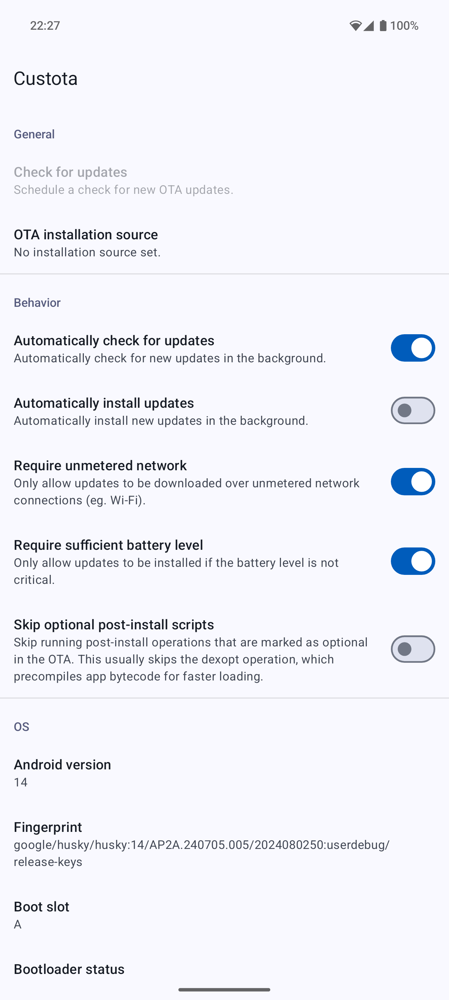
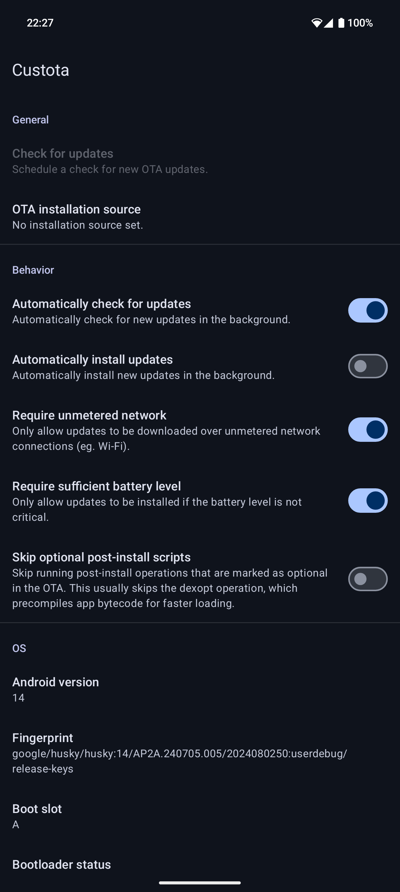

# Pixel Updater


Pixel Updater is an app for installing Android A/B OTA updates from Google's OTA server.

Pixel Updater is installed via a Magisk module so that it can run as a system app.

 

Pixel Updater was forked from [Custota](https://github.com/chenxiaolong/Custota) by [Andrew Gunnerson](https://github.com/chenxiaolong)

## Features

* Supports Android 13 and newer.
* Supports pausing, resuming, and cancelling updates.
* Supports skipping optional post-install scripts to speed up updates.
* Never communicates with any server besides Google's OTA server.

## Limitations

* The device must be rooted with Magisk. KernelSU is not supported.
* The device must be a Google Pixel and support A/B updates.
* Incremental updates are not supported.
* Pre-downloading an update to install later is not supported.
  * Pixel Updater runs `update_engine` in streaming mode, which downloads and installs OTAs at the same time.
* The stock OS' Settings app on Pixel devices always launches the builtin OTA updater.
  * These shortcuts in the Settings app are loaded from GmsCore (part of Google Play Services) via a mechanism called "settings slices" and cannot be overridden. Apps that launch the OTA updater via the standard `android.settings.SYSTEM_UPDATE_SETTINGS` intent will show a prompt to pick between Pixel Updater or the builtin OTA updater.

## Usage

1. Download the latest version from the [releases page](https://github.com/PixelUpdater/PixelUpdater/releases). To verify the digital signature, see the [verifying digital signatures](#verifying-digital-signatures) section.

2. Install the Pixel Updater module in Magisk.

3. Reboot and open Pixel Updater.

4. That's it!

Pixel Updater will optionally automatically check for updates periodically.

To reduce battery usage, the scheduling of the update checks is controlled by Android. They run at most once every 6 hours and will not run at all if the `Require unmetered network` or `Require sufficient battery level` conditions aren't met.

## Permissions

* `ACCESS_CACHE_FILESYSTEM` (**automatically granted by system app permissions**)
  * Needed to store temporary OTA files.
* `ACCESS_NETWORK_STATE` (**automatically granted at install time**)
  * Needed on Android 14+ for unmetered network background run condition.
* `FOREGROUND_SERVICE`, `FOREGROUND_SERVICE_SPECIAL_USE` (**automatically granted at install time**)
  * Needed to run the OTA update service in the background.
* `INTERNET` (**automatically granted at install time**)
  * Needed to communicate with the OTA server. Pixel Updater **does not and will never** communicate with any server outside of Google's OTA server. There are no ads, analytics, or any sort of tracking.
* `MANAGE_CARRIER_OEM_UNLOCK_STATE`, `MANAGE_USER_OEM_UNLOCK_STATE`, `READ_OEM_UNLOCK_STATE` (**automatically granted by system app permissions**)
  * Needed to show the bootloader unlock status.
* `POST_NOTIFICATIONS` (**must be granted by the user**)
  * Android requires a notification to be shown in order for the updater service to reliably run in the background.
* `REBOOT` (**automatically granted by system app permissions**)
  * Needed to reboot the device when the user explicitly presses the reboot button in Pixel Updater's notification after an update is installed.
* `RECEIVE_BOOT_COMPLETED` (**automatically granted at install time**)
  * Needed to schedule periodic update checks.
* `WAKE_LOCK` (**automatically granted at install time**)
  * Needed to keep the CPU awake while an update is being installed.

## Advanced features

### Debug mode

Pixel Updater has hidden debug options that can be enabled or disabled by long pressing the version number.

### Logs

To access the Pixel Updater's logs, enable debug mode and press `Open log directory` to open the log directory in the system file manager (DocumentsUI). Or alternatively, browse to `/sdcard/Android/com.github.pixelupdater.pixelupdater/files` manually.

* `check.log`, `install.log`, and `revert.log`: Logs for the last check/install/revert operation.
* `crash.log`: Logs for the last crash.
* `magisk.log`: Logs for the Magisk patch operation.
* `/data/local/tmp/pixelupdater_selinux.log`: Logs for the SELinux changes made during boot.
  * This log cannot be saved to the normal log directory because it is written prior to the user unlocking the device for the first time after booting.

When reporting bugs, please include the log files as it is extremely helpful for identifying what might be going wrong. The logs should contain no sensitive information.

(To monitor `update_engine`'s own logs, run `adb logcat '*:S' update_engine`.)

### Reinstallation

For testing, Pixel Updater can allow the current OS version (i.e. matching build fingerprint) to be reinstalled. To do so, enable debug mode and then enable the `Allow reinstall` toggle.

### Reverting an update

Normally, an update can be cancelled by pressing the `Cancel` button in the notification while it is being downloaded or installed. However, if the opportunity to do so was missed and the update has already been installed, the update can be cancelled by enabling debug mode and pressing the `Revert completed update` option. This stops the bootloader slot from being switched on reboot. Note that an update can only be reverted if the device hasn't been rebooted yet. Also note that revert does not undo the the changes made to the inactive slot; it simply prevents the device from switching slots on the next reboot.

## How it works

The A/B update process in Android is handled by a builtin component called `update_engine`. The engine is used both for sideloading OTA updates when booted into recovery mode and for regular OTA updates while booted into Android. It is responsible for checking the signature of `payload.bin` inside the OTA zip against `/system/etc/security/otacerts.zip`, verifying existing partition checksums (for incremental updates), and then installing the payload. It also handles the download process when used in the streaming mode, which is always requested by Pixel Updater. Pixel Updater itself is responsible for the other parts, such as checking for updates, verifying compatibility, and preventing downgrades (which could cause the device to be unbootable due to Android Verified Boot's rollback index mechanism).

In order for Pixel Updater to talk to `update_engine` or even discover that the component exists, the SELinux policy must be modified to allow this access. The module ships with a [script](./app/module/post-fs-data.sh) that these modifications (non-persistently) on boot.

There are two parts to the SELinux changes:

1. There's a [`pixelupdater_selinux` native executable](./app/src/main/cpp/pixelupdater_selinux) that performs all of the policy modifications. It takes the `untrusted_app` domain and makes a copy of it as `pixelupdater_app`. Then, it adds the relevant rules to allow only `pixelupdater_app` to access `update_engine`. The domain is copied from `untrusted_app` instead of the normal `priv_app` domain that is assigned to system apps because Pixel Updater does not require any of the additional privileges that would have been granted by `priv_app`.

2. An `seapp_contexts` rule is added to `/dev/selinux/apex_seapp_contexts`, which actually sets up the association between Pixel Updater (app package ID: `com.github.pixelupdater.pixelupdater`) and the new SELinux domain (`pixelupdater_app`).

These changes help limit Pixel Updater's privileges to exactly what is needed and avoids potentially increasing the attack surface via other apps.

### Update process

When Pixel Updater checks for updates, it will:

1. Download the `metadata.pb` entry and validate the fields to determine if the OTA is suitable for installation on the device.
2. Show the update prompt if the OTA fingerprint does not match the running system and the security patch level is newer than the running system.

When the user chooses to install an update, Pixel Updater will repeat the first step above and then:

1. Download the `payload_metadata.bin` entry (`payload.bin`'s header), write it to `/data/ota_package/payload_metadata.bin`, and ask `update_engine` to verify that the listed partition operations are suitable to be performed on the current device.
2. Download `care_map.pb` and write it to `/data/ota_package/care_map.pb`. This is unused for devices with virtual A/B partitioning (ie. snapuserd).
3. Download `payload_properties.txt`, parse the payload digests, and ask `update_engine` to download and install `payload.bin`.

## Verifying digital signatures

Both the zip file and the APK contained within are digitally signed.

### Verifying zip file signature

First, save the public key to a file listing the keys to be trusted.

```bash
echo pixelupdater ssh-ed25519 AAAAC3NzaC1lZDI1NTE5AAAAIMhOIXQSss8MibtGMGOyvJHeB3e7osngI5nsLLU3H55P > pixelupdater_trusted_keys
```

Then, verify the signature of the zip file using the list of trusted keys.

```bash
ssh-keygen -Y verify -f pixelupdater_trusted_keys -I pixelupdater -n file -s PixelUpdater-<version>-release.zip.sig < PixelUpdater-<version>-release.zip
```

If the file is successfully verified, the output will be:

```text
Good "file" signature for pixelupdater with ED25519 key SHA256:1cqrYVWgvt/jDU+RvaCJHpdET6yZHEInmLPUy2PDK5A
```

### Verifying apk signature

First, extract the apk from the zip and then run:

```text
apksigner verify --print-certs system/priv-app/com.github.pixelupdater.pixelupdater/app-release.apk
```

Then, check that the SHA-256 digest of the APK signing certificate is:

```text
766538c98337dae57f6c1e15f2c5ca89c62b25c4ba49b06a244c96f6e0d5e957
```

## Building from source

### Building app and module

Pixel Updater can be built like most other Android apps using Android Studio or the gradle command line.

To build the APK:

```bash
./gradlew assembleDebug
```

To build the Magisk module zip (which automatically runs the `assembleDebug` task if needed):

```bash
./gradlew zipDebug
```

The output file is written to `app/build/distributions/debug/`. The APK will be signed with the default autogenerated debug key.

To create a release build with a specific signing key, set up the following environment variables:

```bash
export RELEASE_KEYSTORE=/path/to/keystore.jks
export RELEASE_KEY_ALIAS=alias_name

read -r -s RELEASE_KEYSTORE_PASSPHRASE
read -r -s RELEASE_KEY_PASSPHRASE
export RELEASE_KEYSTORE_PASSPHRASE
export RELEASE_KEY_PASSPHRASE
```

and then build the release zip:

```bash
./gradlew zipRelease
```

## Contributing

Bug fix and translation pull requests are welcome and much appreciated!

If you are interested in implementing a new feature and would like to see it included in Pixel Updater, please open an issue to discuss it first. We intend for Pixel Updater to be as simple and low-maintenance as possible, so we are not too inclined to add new features, but we could be convinced otherwise.

## License

Pixel Updater is licensed under GPLv3. Please see [`LICENSE`](./LICENSE) for the full license text.
